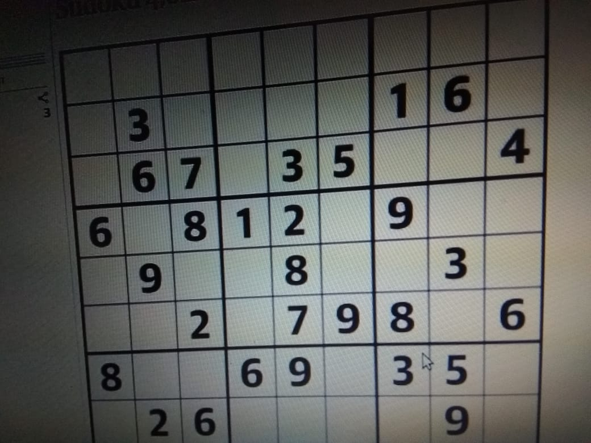
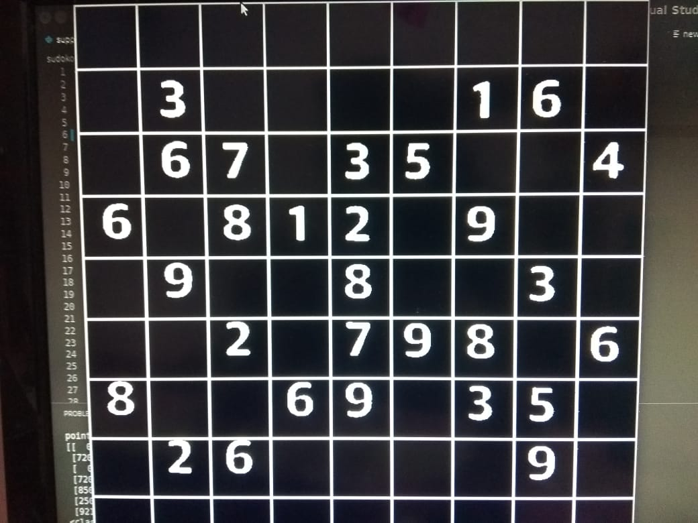
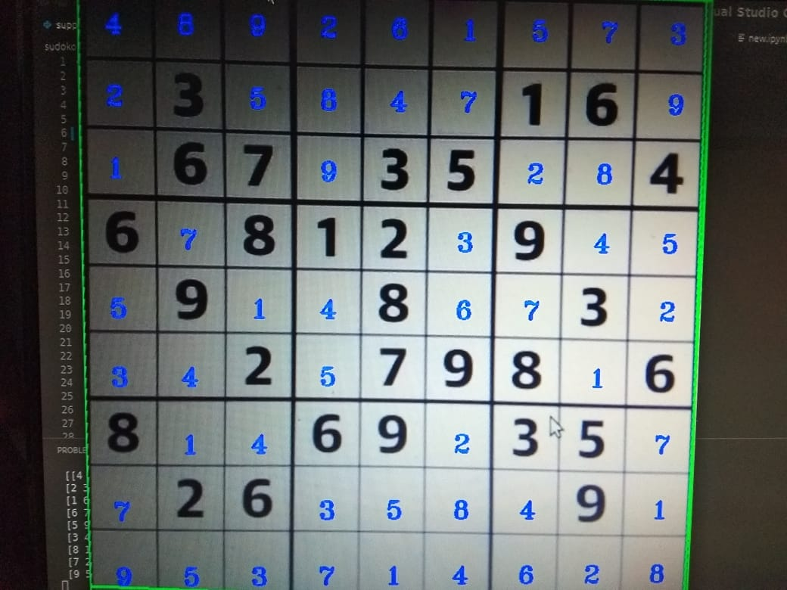
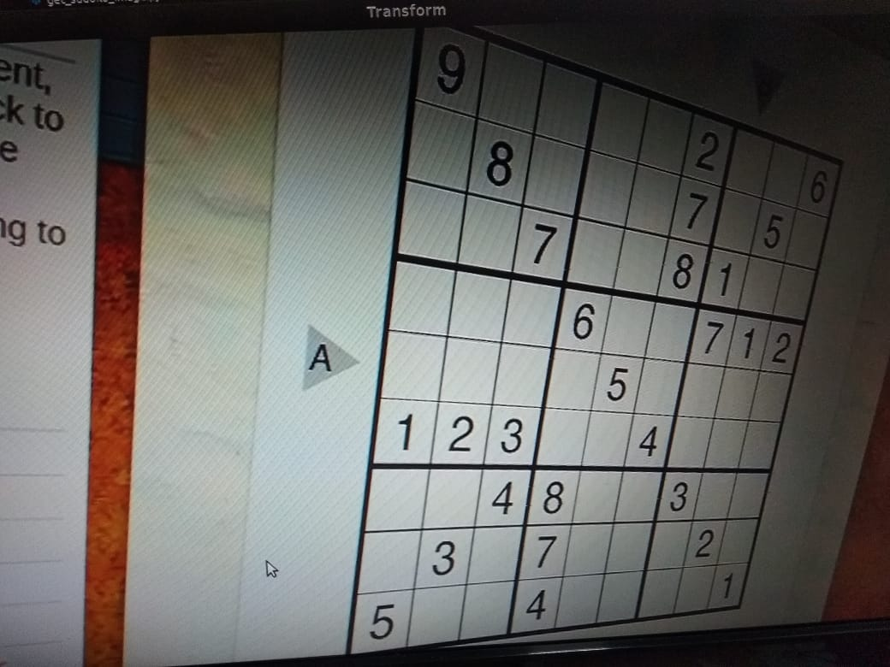
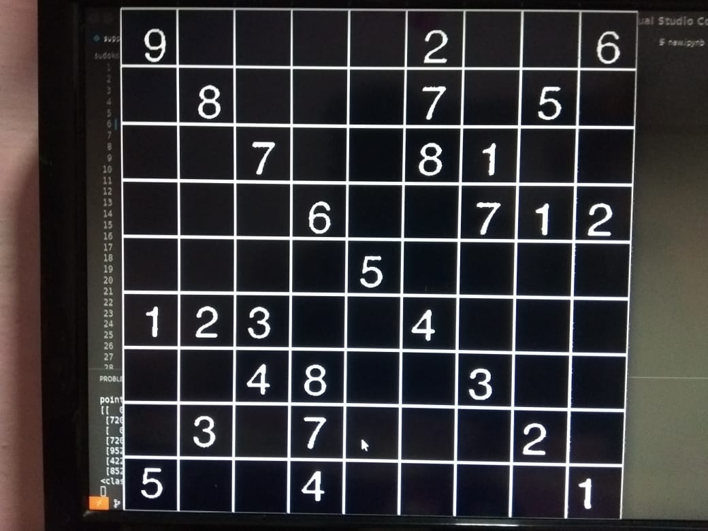
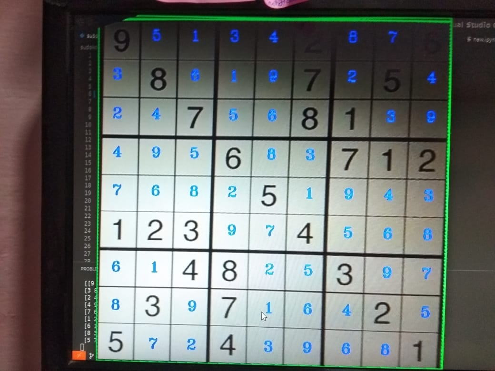

## sudoku_solver
#### This project solves sudoku problems by just using its image 

## Technology Used 
 #### * Tensorflow 
 #### * Opencv 
 #### * Python  
 #### * Numpy 

## Working 
 #### First we will use Opencv to Detect the corner points of Sudoku Box from its Image 
 #### Then we will Transform its prespective using opencv so that further processing becomes easier
 #### Next we will filter the image to remove noise and get the contours of numbers from image
 #### These contours will be then converted into numbers using out tensorflow model trained on Mnist-digits data and some custom genarated images 
 #### Next the unsolved_sudoko will be solved using backtraking and projected on the original image

## Images 
 ### image no 1
 
 #### initial
 </img>
 #### processed
 </img>
 #### output 
 </img>
 
 ### image no 2
 
 #### initial
 </img>
 #### processed
 </img>
 #### output 
 </img>
